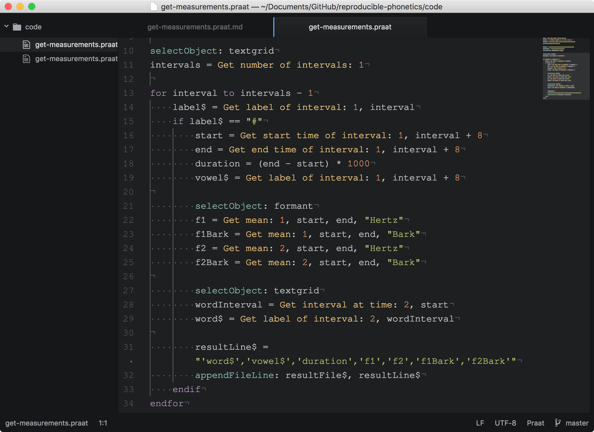

```{r setup, include=FALSE}
knitr::opts_chunk$set(echo = FALSE, fig.cap="", fig.path = "figures/", fig.align = "center")
devtools::load_all("../speakr")
library(tidyverse)
theme_set(theme_light())
```

# Reproducible research

[figure reproducible]

# Reproducible research


# Why should we care?

The problem [@sandve2013]:

- difficulty of reproduction
- difficulty of replication
- retracted papers

The solution:

- Reproducible Research (RR)

# A case from linguistics

The "Yokuts vowels" case [@weigel2002]:

- about **75%** of the data is contrieved [@weigel2005, 149]
- some of the generalisations are **wrong** [@blevins2004a]

# Reproducible Research in linguistics

- linked data [@bird2003; @thieberger2004]
- computational grammar [@maxwell2005]
- `glossbox` [@mcdonnell2017]
- RR in the Speech Sciences [@abari2012]

# RR in phonetics: the workflow

- 

# Phase A: source code and documentation

Praat scripting:

- Atom editor (for syntax highlighting and snippets)
- Literate Markdown
    - tangle: `lmt`
    - weaving: `pandoc`

# Atom



# `lmt`

[figure]

# `pandoc`

[figure]

# Phase B: the `speakr` package

`speakr` is an `R` package to aid Praat users:

- aim: tangle and run Praat scripts from within `R`
- two main functions
    - `lmt()`: tangle a Praat script
    - `praatRun()`: run a Praat script

# Phase B: the `speakr` package

```{r, echo=TRUE, eval=FALSE}
# Tangle a Praat script
lmt("code/get-measurements.praat.md")

# Run the script
praatRun("code/get-measurements.praat")

# Read the results of the script
vowels <- read_csv("results/vowels.csv") %>%
    mutate_if(is.character, as.factor) %>%
    mutate(vowel = factor(vowel, c("i", "e", "a",
                                   "O", "u")))
```

# Phase B: the `speakr` package

```{r, include=FALSE}
lmt("code/get-measurements.praat.md")
praatRun("code/get-measurements.praat")
vowels <- read_csv("results/vowels.csv") %>%
    mutate_if(is.character, as.factor) %>%
    mutate(vowel = factor(vowel, c("i", "e", "a", "O", "u")))
```

```{r vowel-plot, fig.align="center"}
vowels %>%
    ggplot(aes(F2, F1, colour = vowel)) +
    geom_point() +
    scale_x_reverse(position = "top") +
    scale_y_reverse(position = "right") +
    stat_ellipse() +
    labs(title = "Vowel plot of one speaker of Italian", x = "F2 (Hertz)", y = "F1 (Hertz)")
```

# Phase C: dissemination

- GitHub
- Open Science Framework